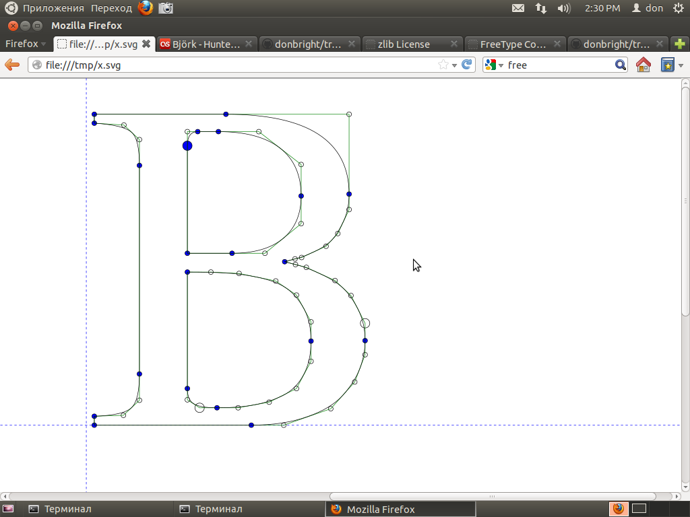
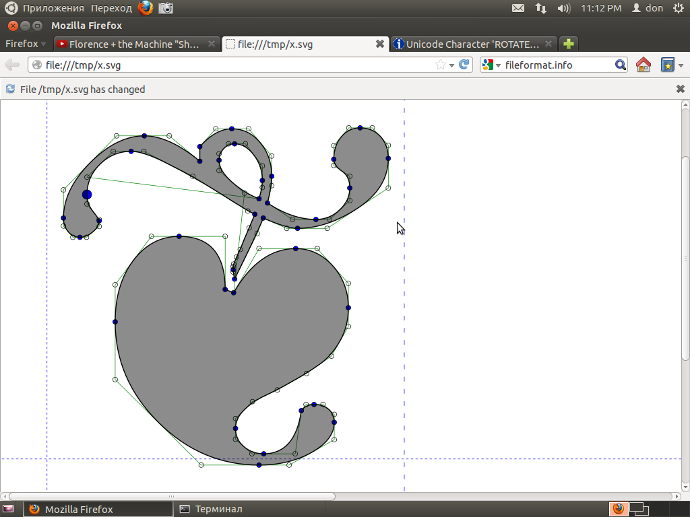

font_to_svg
===========

This library will create SVG path shapes from TrueType font files.

### Current Status

This project has some bugs but will handle 'standard' fonts reasonably well.

Currently this project consists of a C++ language header that can used 
in conjuction with the Freetype library to create a basic conversion 
program that will extract a single character from a .ttf file and create 
a matching .svg file.

The program is stable for basic use. It can output plain glyph shapes or 
it can also output 'debugging' information like the node points & lines. 
There are some bugs with bounding boxes and other 'typographic box' 
issues like Bearing. Also calculation of the SVG "g" tag has some issues 
with transforms/footers.

The code does not currently support OpenType or it's features, such as 
ligatures. It does not support creating an "SVG Font". It only does very 
basic conversion of Truetype glyphs to SVG path shapes. It might not 
be useful for web fonts or other usages. 

### Using in your own C++ project

    #include <truetype_to_svg.hpp>

    int main()
    {
        font2svg::glyph g( "FreeSans.ttf", 67 );
        std::cout << g.outline();
    }

font_to_svg is a 'header library', so you don't have to 'build' it.
You just #include the .hpp file in your C plus plus file, and then be 
sure to link the Freetype library into your program using your compiler/
build system.

### Screenshots of results

Here are two example outputs - letter B and Floral Heart. They both have 
some debugging information turned on (nodes, lines, etc).

### Example programs

There are several example programs included. They use the cmake build 
system ( http://www.cmake.org ). For example:
     
     cmake .
     make
     ./example1 tahoma.ttf 66 > out.svg 
     firefox out.svg

Example 1 and Example 2 just do basic output of a single character into 
a .svg path. The first argument is a truetype font filename, and the 
second argument is a Unicode codepoint number. For example:

    ./example2 ./FreeSerif.ttf 66 > example2.svg 

In the line above, 66 = unicode/ascii for the letter 'B'. You can use 
hexadecimal numbers as well. For example, the Cherokee Letter O has 
hexadecimal Unicode point 0x13A3:

    ./example1 ./FreeSerif.ttf 0x13A3 > example2.cho.svg

To view the resulting svg file, it is easiest to use a browswer like 
Firefox. Go to 'file/open' and point it to your output file. Or type 
something like 'file:///tmp/x.svg' into your address bar. You can also 
get the Firefox addon that can auto-reload files when they change on 
disk.

Another option is to use svg view/edit programs like Inkscape.

Example 3 was created by github user Ebraminio to generate multiple .svg 
files from a single GPL font of ancient Persian letters ( Xerxes.ttf, 
available by a web search )

### Detail on using in your own projcet

As noted, font_to_svg is a 'header library' so you dont need to 
compile any libraries just include the header and use it. You will still 
need to link to Freetype however, using your build system.

Freetype's website is here: http://www.freetype.org/

font_to_svg uses freetype to deal with vaguaries and variations of 
Truetype file formats. font2svg does not use any of Freetype's bitmap 
font-rendering code. font2svg is a pure "outline curve" renderer to be 
used for vector/curve based output.

Font_to_svg comes with a very permissive BSD style copyright license 
described in the LICENSE file in this distribution. Acknowledgment in 
the product documentation would be appreciated but is not required.

To understand the usage, look at the files named 'example*.cpp' that come
with the source code. You can output the bare svg path data, or a bunch
of debugging information.

Don't forget that some fonts have restrictive copyright licenses that 
forbid this type of conversion. You can use fonts from 
http://openfontlibrary.org If you want to be safe from accusations of 
copyright violation.

### Finding cool Unicode points

http://www.fileformat.info/info/unicode/block/index.htm

### How does Truetype actually work then? How does this program work?

Truetype fonts consist of a group of characters layed out in a file. The 
truetype file format is very complicated, with various issues related to 
character sets, glyph indexes, duplicated positions, etc etc etc. font2svg 
uses the Freetype library to make it easy to deal with those problems 
and to load the file into memory.

Each character in the Truetype file has a sequence of 'contours', which 
are basically a sequence of curves and lines that form a single shape. 
Some contours count as the 'body' of the letter, while others are the 
'holes' of a letter. The letter 'B' for example has a single contour for 
the 'outside' shape, and two 'hole' contours for the two inside shapes.

Truetype marks these contours in a special way - by the 'clockwise' ness 
of the order in which it lists the points that make up a contour. The 
contours that have their points in 'clockwise' order are considered 
'solid' The contours that have their points listed in 'counter 
clockwise' (or anti-clockwise) order are considered 'holes'. For example,
imagine the letter 'o'. The points making up the 'outside' contour
are listed in clockwise order, while the points making up the 'inside'
contour are listed in counter-clockwise order.

But what type of points make up a contour? They are simple 2-dimensional 
Cartesian points with integer coordinates. The points for a contour are 
listed in order in the Truetype file. The curves and lines of a contour 
are drawn between the points using the rules of Bezier Curves. This 
means there are actually two different types of points - 'on the curve' 
points and 'off the curve' points. The 'on the curve' points actually 
have lines or curves coming out of them and/or touching them. 'Off the curve'
curves represent the 'control' points between the 'on the curve' points.

Now, Truetype doesn't just use any old Bezier curve. It uses a type of 
Bezier called 'Quadratic', which consists of two endpoints 'on the 
curve' and one 'control point'. If you check the Wikipedia article for 
Bezier Curve, you can see simple animated examples. The math is not 
actually as complicated as it looks - you can draw a Bezier Quadratic
using only a ruler and a pencil.

Now... in Truetype there is a special feature in the way off-curve 
points are listed. If two are listed in a row, then there is actually a 
'hidden' or 'implied' on-curve point at a position exactly halfway 
between them. font2svg does not draw these points but they are easy to imagine
when looking at the debug code. 

Now. How does font2svg do SVG output? It basically just copies the point 
and contour information in the TrueType file and splits it into SVG 
paths. The actual rendering of the SVG file to something on a computer 
screen is left to the SVG rendering programs, like web browsers or 
Inkscape. The most complicated thing that these renderers do is probably 
the "non-zero winding rule", which is a geometry rule that determines 
how to properly draw the 'holes' and 'body' contours of a character 
glyph. font2svg doesn't have to worry about that either - it just inserts 
the svg property 'non-zero' fill-type into the generated SVG and the SVG 
renderer should take care of the rest.

Please see these sites for more info.

 * Basic Terms: http://www.freetype.org/freetype2/docs/glyphs/glyphs-3.html
 * FType + outlines: http://www.freetype.org/freetype2/docs/reference/ft2-outline_processing.html
 * FType + contours: http://www.freetype.org/freetype2/docs/glyphs/glyphs-6.html
 * TType contours: https://developer.apple.com/fonts/TTRefMan/RM01/Chap1.html
 * TType contours2: http://www.truetype-typography.com/ttoutln.htm
 * Non-zero winding rule: http://en.wikipedia.org/wiki/Nonzero-rule
 * SVG paths: http://www.w3schools.com/svg/svg_path.asp
 * SVG paths + nonzero: http://www.w3.org/TR/SVG/painting.html#FillProperties

### What about rendering multiple characters?

To do this properly for all languages, you actually need a 'layout 
engine', like Harfbuzz and/or Pango. These are at present, far beyond 
the scope of this project. 

It may be possible to render strings of characters in 'non-connected' 
scripts, for example English ( Latin alphabet), or Chinese, using the 
basic bounding box information. However this library, at present, is 
probably not very suitable for ligature + combination scripts like 
Arabic or Devanagari.

### Test characters

Nice characters that show unusual patterns. Good for testing.
./example1 FreeSerif.ttf 67 > x.svg
./example1 FreeSerif.ttf 68 > x.svg
./example1 FreeSerif.ttf 0x2766 > x.svg
./example1 FreeSerif.ttf 0x2767 > x.svg
./example1 FreeSerif.ttf 0x1f01a > x.svg
./example1 FreeSerif.ttf 0x48007 > x.svg

### Other projects

The "Batik" project does similar stuff. It is Java:

http://xmlgraphics.apache.org/batik/tools/font-converter.html

### Finding A Unicode font

An easy resource is here:

http://openfontlibrary.org

If you have linux, you can explore as follows:

Run 'charmap', under ubuntu, and then right click on interesting looking 
glyphs. It will give you some rough idea of the font name.

Then do 'locate ttf | grep ttf$' which will give a list of all Truetype 
font files (w .ttf extensions) on your system .

You can match this up with what you did in Charmap, then maybe you can find
the truetype you are looking for. 

### Linux non-cmake build

    # BSD/Linux - 

    # install freetype using your package manager
    # (something like sudo apt-get install libfreetype6-dev)
    # then copy a .ttf file to this directory for convenience
    cp `locate FreeSerif.ttf | tail -1 ` .
    ./build.sh
    ./example1 ./FreeSerif.ttf 66 > /tmp/x.svg 
    firefox /tmp/x.svg

### Todo

get real name of glyph (like unicode name)

investigate linux's auto-finding of unicode glyphs

auto-find fonts on linux, not require cmdline fontname?

accept U+4034 (hex) input format

regression test

Long term - opentype? pango / harfbuzz?

### Trademark disclaimer

TrueType is a trademark of Apple, Inc. This library is not in any way 
affiliated nor endorsed by Apple, Inc. 

